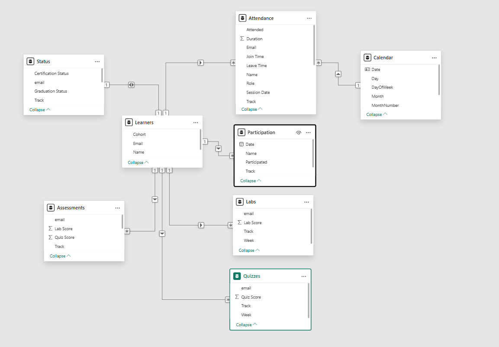
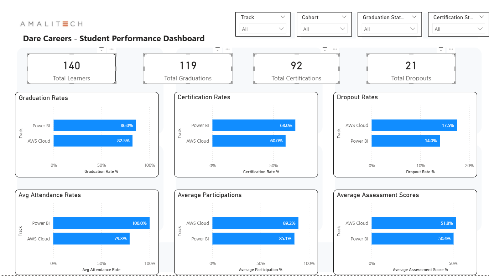
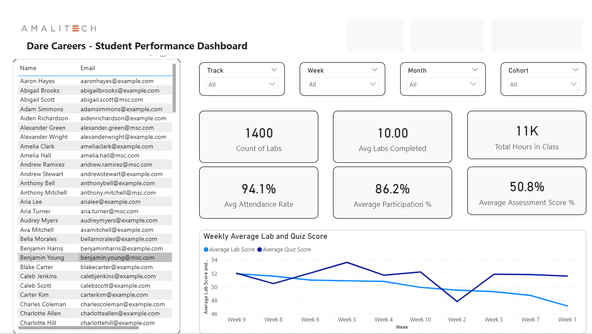

# Dare Careers Power BI Dashboard Project

A comprehensive Business Intelligence solution built in Power BI to monitor learner progress and performance for Dare Career's AWS and Power BI training programs.

---

## Overview

Dare Careers provides professional training in Power BI and AWS Cloud technologies. This dashboard enables program managers and trainers to:
- Monitor learner engagement in real-time
- Track attendance compliance (30-minute threshold)
- Analyze assessment performance trends
- Identify at-risk learners early
- Measure certification and graduation outcomes

**Data Sources Integrated:**
- Zoom attendance records
- Participation tracking
- Lab assignments
- Quiz assessments
- Learner status updates

### Key Success Metrics
- **Graduation Rate**: % of learners completing the program
- **Certification Rate**: % of learners achieving certification
- **Dropout Rate**: % of learners who exit before completion
- **Average Attendance**: % of class time attended (>30 min threshold)
- **Average Participation**: Daily engagement scores
- **Average Assessment Scores**: Combined quiz and lab performance

---

## Data Architecture

### Data Sources
The project integrates five main data sources from Dare Career's training programs:

| Data Source | Description | Organization |
|------------|-------------|--------------|
| **Labs** | Weekly lab assignment scores | Organized by track (Power BI/AWS) and week (Week 1-10) |
| **Quizzes** | Weekly quiz assessment scores | Organized by track (Power BI/AWS) and week (Week 1-10) |
| **Participation** | Daily learner engagement records | Organized by track and week |
| **Zoom Attendance** | Session attendance duration logs | Organized by track and week |
| **Learner Status** | Certification and graduation status | Organized by track |

#### Data Files Organization
```
data
├───Cloud Training
│   ├───Labs & Quizes
│   ├───Participation
│   ├───Status of Learners
│   └───Zoom Attendance
│       ├───Week 1
│       ├───Week 10
│       ├───Week 2
│       ├───Week 3
│       ├───Week 4
│       ├───Week 5
│       ├───Week 6
│       ├───Week 7
│       ├───Week 8
│       └───Week 9
└───PowerBI Training
    ├───Labs & Quizes
    ├───Participation
    ├───Status of Learners
    └───Zoom Attendance
        ├───Week 1
        ├───Week 10
        ├───Week 2
        ├───Week 3
        ├───Week 4
        ├───Week 5
        ├───Week 6
        ├───Week 7
        ├───Week 8
        └───Week 9
```

---

## Data Transformation Process

### Power Query Transformations

#### A. Zoom Attendance

**Transformations Applied:**
- Combined all attendance files from both tracks (Power BI and AWS) across all 10 weeks
- Add a conditional column **"Attended if > 30 minutes then 1 else 0"** to categorize attendance based on duration:
- Standardized date and time formats across all records using Power Query

#### B. Participation

**Transformations Applied:**
- Combined all participation records for both tracks
- Extract week from file name
- Cleaned and standardized learner names
- Normalized text formatting across entries

#### C. Labs and Quizzes

**Transformations Applied:**
- Merged weekly lab and quiz files for all 10 weeks
- Added **AssessmentType** column to distinguish between Labs and Quizzes
- Standardized column naming: Email, Track, Week, Score
- Ensured numeric data types for score fields
- Handled invalid or missing entries
- Created unified **Assessments** fact table combining both assessment types

#### D. DimLearnerStatus

**Transformations Applied:**
- Combined learner status files for both tracks
- Cleaned and standardized:
  - Certification Status column
  - Graduation Status column

#### E. DimLearners

**Transformations Applied:**
- Extract learner names, email addresses and tracks from attendance
- Removed duplicates
- Add a **Cohort** column for grouping learners 

### Additional Data Model Preparation

- Built **DateDimension** table with Date and Month fields for time-based filtering
- Implemented DAX measures for:
  - Average calculations
  - Attendance percentages
  - Engagement metrics
- Configured slicers for dynamic filtering by Track, Cohort, Week, Certification Status, and Month

---

## Data Model

### Star Schema Design

#### Dimension Tables
- **DimLearners**: Contains learner information
- **DimDate**: Date-based temporal dimension
- **DimLearnerStatus**: Certification and graduation outcomes

#### Fact Tables
- **Attendance**: Session attendance duration records
- **Participation**: Daily engagement tracking
- **Assessments**: Combined labs and quizzes scores

### Data Model Diagram



---

## Dashboard Visualizations

### Page 1: Overall Performance Metrics
Provides a high-level overview of program performance across all learners and tracks.



### Page 2: Detailed Learner Insights
Enables drill-down analysis into individual learner performance and risk assessment.



---

## Project Structure

```
dare-careers-powerbi-dashboard
│   .gitignore
│   README.md
│
├───dashboard
│       Dare_Careers_Analysis_Dashboard.pbix│
└───data/
│   ├───Cloud Training
│   ├───PowerBI Training
└───screenshots/
│   ├───overview.png
│   ├───detailed.png
│   └───modeling.png
```

